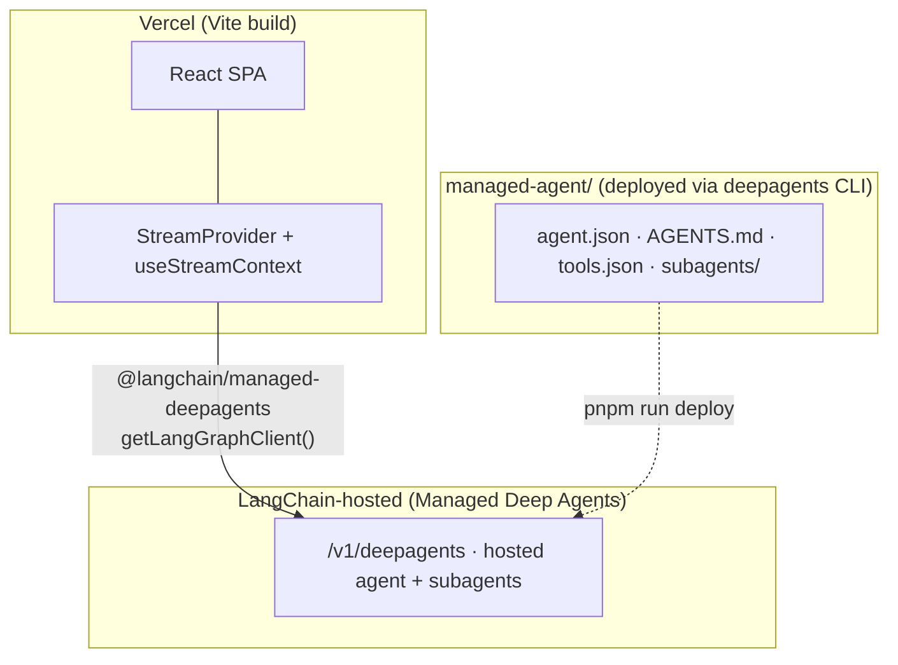

# Deploying a LangChain Agent as a Managed Deep Agent

A self-contained Vite + React chat demo backed by a **Managed Deep Agent** — a deep agent that [LangChain hosts for you](https://docs.langchain.com/langsmith/managed-deep-agents-overview) (currently in **private preview**). Instead of shipping a graph and running an Agent Server, you deploy a small **declarative project** (`managed-agent/`) — `agent.json`, `AGENTS.md`, and `subagents/` — with the `deepagents` CLI, and LangChain runs the agent.

The UI in `src/` streams from the hosted agent through the [`@langchain/managed-deepagents`](https://www.npmjs.com/package/@langchain/managed-deepagents) SDK's LangGraph client adapter and `@langchain/react`'s `StreamProvider`.

> [!NOTE]
> **Managed Deep Agent vs. LangSmith Deployment.** This example deploys a **Managed Deep Agent** (LangChain hosts the agent; you deploy declarative files). Its sibling [`../js-langsmith`](../js-langsmith) deploys the **same agent** as a **LangSmith Deployment** (you define the graph in code and host it on the LangGraph Agent Server). A Managed Deep Agent is **not** a LangSmith Deployment.
>
> | Use this example (Managed Deep Agent) when…                              | Use [`js-langsmith`](../js-langsmith) (LangSmith Deployment) when…          |
> | ------------------------------------------------------------------------ | --------------------------------------------------------------------------- |
> | You want the least infrastructure — LangChain runs the agent for you.    | You want full control over the graph, runtime, checkpointer, and middleware. |
> | Behavior fits instructions + skills + subagents, and tools are MCP servers. | You ship custom code tools and bespoke graph logic.                       |
> | You have Managed Deep Agents private-preview access and want a hosted agent fast. | You're on LangGraph and want the standard Agent Server (`/threads`, `/runs`) API. |

The deployed agent mirrors the deep agent used across this cookbook: a coordinator that delegates to `researcher` and `math-whiz` subagents.

## Architecture



| Piece                      | Location         | Deploy target                                   |
| -------------------------- | ---------------- | ----------------------------------------------- |
| Managed Deep Agent project | `managed-agent/` | Managed Deep Agents (`pnpm run deploy`)         |
| Chat UI                    | `src/`           | Vercel (`pnpm build` → `dist/`)                 |

## Prerequisites

- Managed Deep Agents [private-preview access](https://www.langchain.com/langsmith-managed-deep-agents-waitlist) (LangSmith Cloud, US region).
- A [LangSmith API key](https://docs.langchain.com/langsmith/create-account-api-key) for a workspace with preview access, exported as `LANGSMITH_API_KEY`.
- The `deepagents` CLI, version `0.2.2` or later:

```bash
uv tool install "deepagents-cli>=0.2.2"
# or: pip install -U "deepagents-cli>=0.2.2"
deepagents --version   # confirm >= 0.2.2 (an older `deepagents` on PATH can shadow it)
```

## The Managed Deep Agent project (`managed-agent/`)

Deploy syncs every file in this directory to the hosted agent's managed file tree:

```
managed-agent/
├── agent.json                       # name, model, backend
├── AGENTS.md                        # coordinator instructions (system prompt)
├── tools.json                       # MCP-backed tools (empty by default)
└── subagents/
    ├── researcher/
    │   ├── agent.json               # description + model
    │   └── AGENTS.md                # subagent instructions
    └── math-whiz/
        ├── agent.json
        └── AGENTS.md
```

`agent.json` declares the model in `{provider}:{model_id}` form and the backend:

```json
{
  "name": "deployment-cookbook-coordinator",
  "model": "openai:gpt-5.4-mini",
  "backend": { "type": "state" }
}
```

See the [CLI project file reference](https://docs.langchain.com/langsmith/managed-deep-agents-cli#project-file-reference) for every field, and [Choose a backend](https://docs.langchain.com/langsmith/managed-deep-agents-deploy#choose-a-backend) for the `sandbox` option.

### Tools are MCP-backed

A Managed Deep Agent can only call tools that come from a registered **MCP server** (it can't run local code tools like the LangGraph example's mock `search_web`/`calculator`). `tools.json` ships empty so the first deploy succeeds. To give the agent or a subagent real tools, [register an MCP server](https://docs.langchain.com/langsmith/managed-deep-agents-mcp) for the workspace, then add entries:

```bash
deepagents mcp-servers add --url https://example.com/mcp --name my-tools
deepagents mcp-servers tools my-tools   # prints a paste-ready tools.json snippet
```

```json
{
  "tools": [
    { "name": "search_web", "mcp_server_url": "https://example.com/mcp", "mcp_server_name": "my-tools" }
  ]
}
```

Drop the snippet into `managed-agent/tools.json` (or `managed-agent/subagents/<name>/tools.json` for a subagent-scoped tool) and redeploy. Deploy validates referenced MCP server URLs before sending the request.

## Deploy the agent

```bash
cd js-langsmith-managed
cp .env.example .env          # set LANGSMITH_API_KEY
export LANGSMITH_API_KEY=lsv2-...   # or rely on the project .env
pnpm install
pnpm run deploy               # → deepagents deploy --dir managed-agent
```

Preview the payload and managed file tree first with `deepagents deploy --dir managed-agent --dry-run`.

The first deploy **creates** the agent; later deploys **update** the same one (deploy state is tracked locally). On success the CLI prints the agent name, **`agent_id`**, revision, agent URL, and an MCP health check. **Save the `agent_id`** — the UI needs it.

To deploy into a shared/known agent instead, set `"agent_id"` in `managed-agent/agent.json`. See [Update a shared agent](https://docs.langchain.com/langsmith/managed-deep-agents-deploy#update-a-shared-agent).

## Run the chat UI against the hosted agent

Managed Deep Agents are hosted-only — there's no local agent runtime, so the UI always streams from your **deployed** agent. Point the frontend at it:

```bash
# in .env
LANGSMITH_MANAGED_AGENT_ID=<agent_id from deploy>
LANGSMITH_API_KEY=lsv2-...                # the same key you deploy with
```

```bash
pnpm dev                    # Vite dev server on http://localhost:5173
# or build a production bundle:
pnpm build && pnpm preview
```

The UI builds a LangGraph client with `new Client({ apiKey }).getLangGraphClient({ agentId })`, which rewrites thread and run requests onto the `/v1/deepagents` routes (see `src/lib/chat/threads-client.ts`). Until `LANGSMITH_MANAGED_AGENT_ID` is set, the app shows a short "deploy and configure" message instead of the chat.

Both client vars use the `LANGSMITH_` prefix so a single `LANGSMITH_API_KEY` serves deploy **and** the browser client: Vite's `envPrefix` (in `vite.config.ts`) exposes `LANGSMITH_`-prefixed vars to the browser, so there's no separate `VITE_`-prefixed copy to keep in sync.

> [!WARNING]
> **API key in the browser.** Exposing `LANGSMITH_API_KEY` to the client ships your key in the built bundle — fine for a local demo, not for production. In a real app, proxy requests through your own backend with a custom `fetch` and never expose the key.

> [!NOTE]
> **Private-preview limitations.** The Managed Deep Agents API does not mirror every Agent Server endpoint yet. The thread-history sidebar is best-effort against a hosted agent (thread search/state may be unavailable), so past threads and derived titles can be empty. Streaming chat, subagents, and tool-call rendering work.

## Deploy the frontend to Vercel

1. Connect the repo in Vercel with **Root Directory** `js-langsmith-managed`.
2. Vercel auto-detects Vite — build output is `dist/`.
3. Set environment variables:
   - `LANGSMITH_MANAGED_AGENT_ID` — the deployed Managed Deep Agent id
   - `LANGSMITH_API_KEY` — LangSmith API key (exposed to the build via `envPrefix`; preferably proxy through a backend instead)

The agent itself is redeployed with `pnpm run deploy` (or `deepagents deploy`) — there's no separate server to host.

## Run from the CLI or SDK

You don't need the UI to run the agent. Stream a response with the [TypeScript SDK](https://docs.langchain.com/langsmith/managed-deep-agents-sdk):

```ts
import { Client } from "@langchain/managed-deepagents";

const agentId = process.env.MANAGED_AGENT_ID!;
const client = new Client({ apiKey: process.env.LANGSMITH_API_KEY });

const thread = await client.threads.create({ agent_id: agentId });
const lg = client.getLangGraphClient({ agentId });

const stream = lg.runs.stream(thread.id, agentId, {
  input: { messages: [{ role: "user", content: "Research LangGraph streaming, and separately calculate 42 * 17." }] },
  streamMode: ["values", "updates", "messages-tuple"],
  streamSubgraphs: true,
});

for await (const event of stream) console.log(event.event, event.data);
```

## Project layout

```
js-langsmith-managed/
├── package.json
├── managed-agent/         # Managed Deep Agent project (deployed via deepagents CLI)
├── vite.config.ts
├── index.html
├── tsconfig*.json
├── src/                   # Vite + React SPA
└── .env.example
```

## References

- [`js-langsmith`](../js-langsmith) — the same agent deployed as a LangSmith Deployment (LangGraph Agent Server)
- [Deploy a Managed Deep Agent](https://docs.langchain.com/langsmith/managed-deep-agents-deploy)
- [Managed Deep Agents overview](https://docs.langchain.com/langsmith/managed-deep-agents-overview) · [quickstart](https://docs.langchain.com/langsmith/managed-deep-agents-quickstart)
- [Managed Deep Agents CLI reference](https://docs.langchain.com/langsmith/managed-deep-agents-cli) · [SDKs](https://docs.langchain.com/langsmith/managed-deep-agents-sdk)
- [Connect tools (MCP)](https://docs.langchain.com/langsmith/managed-deep-agents-mcp)
